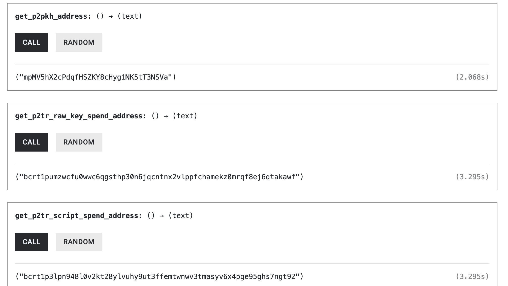
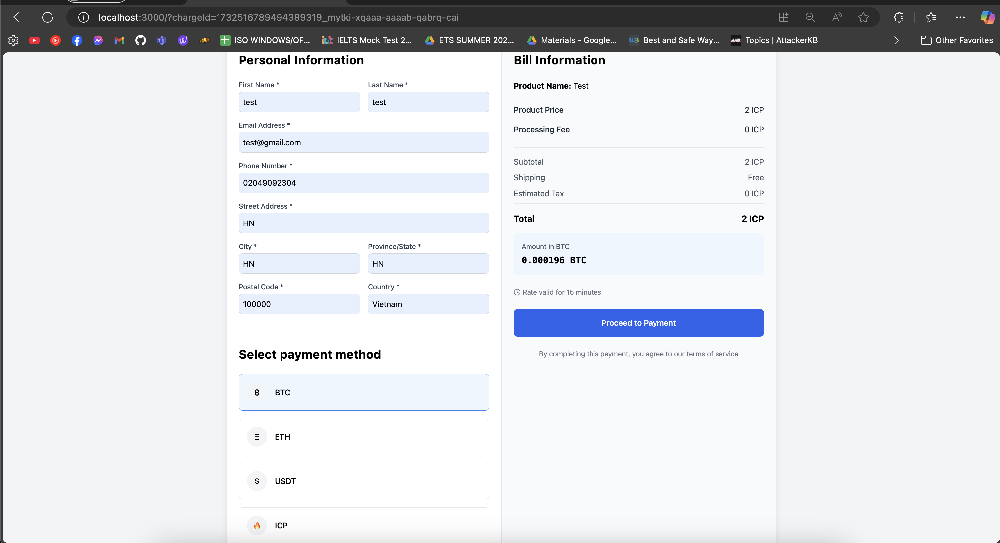

# ICP Payment Gateway with Bitcoin Integration

## Overview
A decentralized payment gateway built on the Internet Computer Protocol (ICP) with seamless Bitcoin (BTC) integration, enabling merchants to accept payments across blockchain networks.

## Features
- Multi-chain support (ICP and BTC)
- User-friendly interface for merchants and customers
- Automated payment processing
- Bitcoin network integration

## Prerequisites
- Rust
- dfx (Internet Computer SDK)
- Bitcoin Core
- Node.js (optional, for frontend)

## Local Development Setup

### 1. Bitcoin Regtest Network and ICP Local Network Setup:
- Follow the instruction as the following link: https://internetcomputer.org/docs/current/tutorials/developer-journey/level-4/4.3-ckbtc-and-bitcoin

### 2. Deploy Canister
- Run the following command to deploy the canister:
```
dfx deploy backend --argument '(variant { regtest})'
```

### 3. Canister Interaction:
- Create BTC address: 

  

- Register merchant and merchant BTC address: 
  ```
  dfx canister call backend register_merchant

  dfx canister call backend register_merchant_addresses '("[your BTC address]")'

  ```

- Create charge: 

  for example:
  ```
  dfx canister call backend create_charge '(record {name="Test"; description="testcharge"; pricing_type="fixed_price"; local_price= record {amount="10"; currency="BTC"}})'
  ```

- Process payment:

  - End user will call to the process_payment function with the charge id they want to pay (the calling will be automatic and user-friendly with out UI when deploy this canister into mainnet):

  ```
  dfx canister call backend process_payment '("[charge id]")'
  ```

  - Future Pay UI with chargeId as the URL parameter:

  
